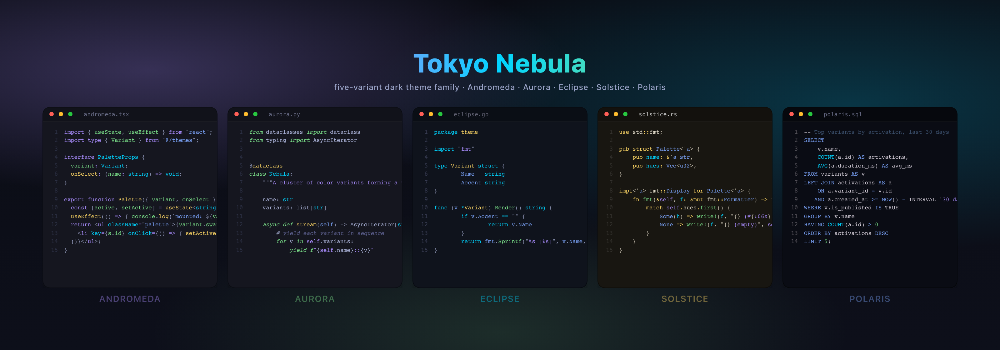
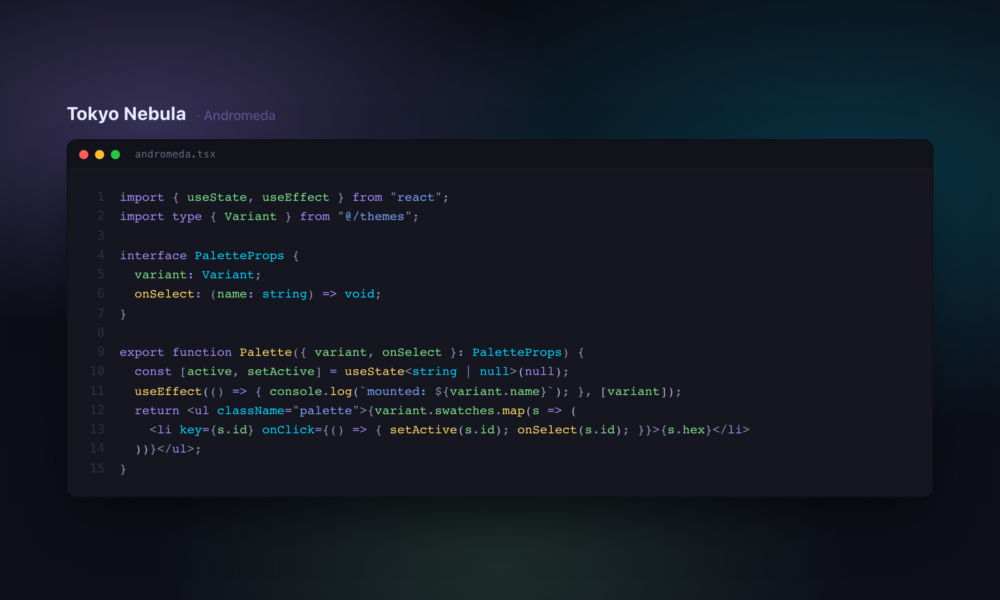
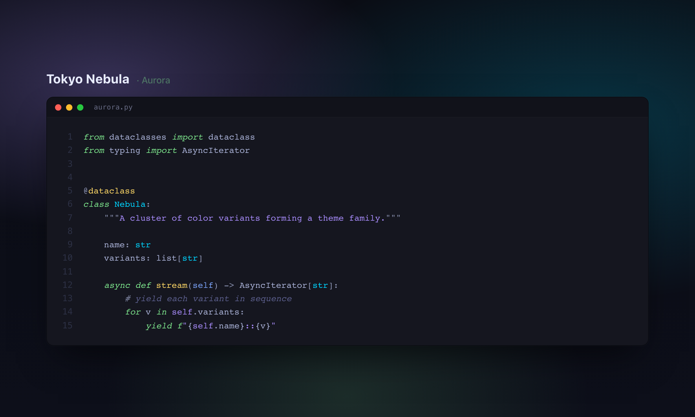
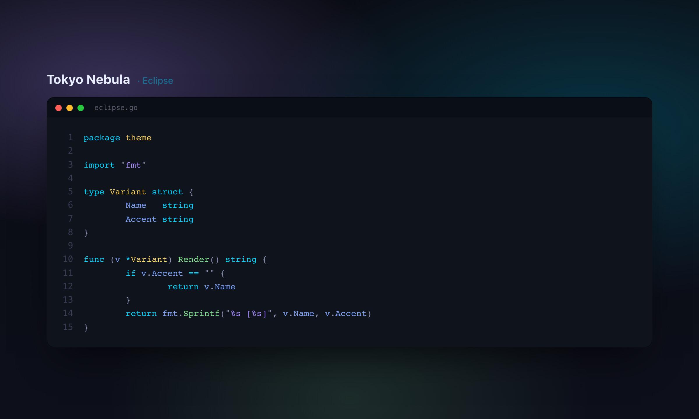
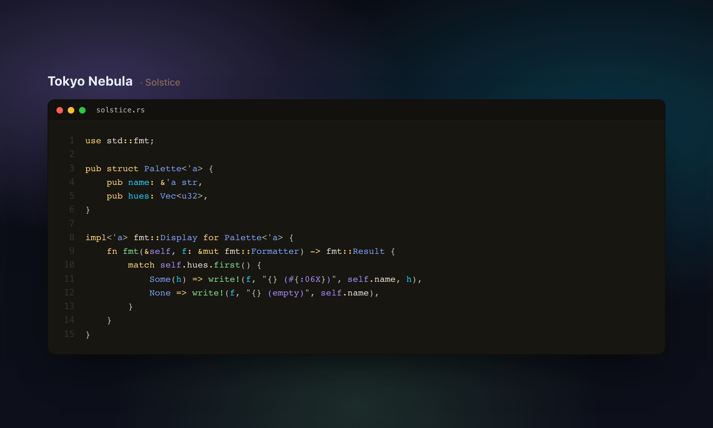
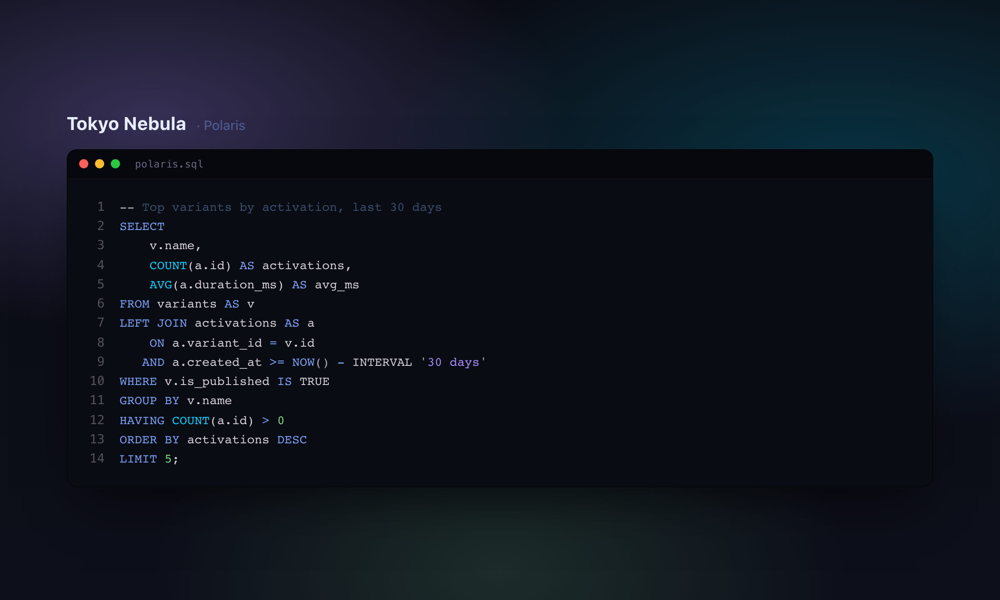

# Tokyo Nebula

A five-variant dark theme family fusing the vibrant syntax highlighting of Andromeda with the elegant palette of Tokyo Night. Available for VS Code and Zed.

## Variants

### Tokyo Nebula Andromeda
Flagship: vibrant Andromeda syntax over a Tokyo Night palette.

### Tokyo Nebula Aurora
Andromeda with italic styling for keywords and comments.

### Tokyo Nebula Eclipse
Stealth monochrome over the Tokyo Night base, for distraction-free coding.

### Tokyo Nebula Solstice
Warm, sunset-tinged variant for evening sessions.

### Tokyo Nebula Polaris
Navy, low-contrast variant with operator emphasis and subtle borders.

## Installation — VS Code

1. Open the Extensions sidebar in Visual Studio Code
2. Search for **Tokyo Nebula**
3. Click **Install**, then reload
4. Preferences > Color Theme > **Tokyo Nebula Andromeda** (or pick a variant)

## Installation — Zed

Tokyo Nebula for Zed is published as a separate repository:
[**juanarrow-io/tokyo-nebula-zed**](https://github.com/juanarrow-io/tokyo-nebula-zed).

In Zed: open the command palette (`cmd-shift-p`), run `zed: install dev extension`,
and pick a local clone of that repo.

## Credits

- [Andromeda](https://github.com/EliverLara/Andromeda) — the original syntax-highlighting design
- [Tokyo Night](https://github.com/tokyo-night/tokyo-night-vscode-theme) — the palette foundation
- [Andromeda Night](https://github.com/ni3rav/andromeda-night) — the upstream theme this family was forked from

## License

[MIT License](./LICENSE)

Enjoy! :) 😺
