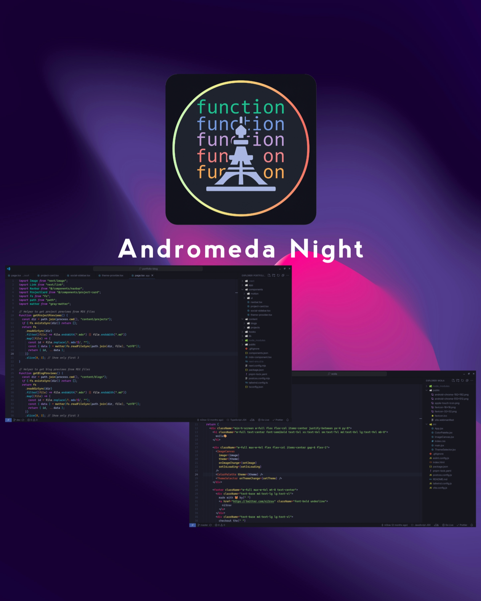

# Tokyo Nebula

A theme family fusing the vibrant syntax highlighting of Andromeda with the elegant palette of Tokyo Night, for a visually stunning and comfortable coding experience. Available for VS Code and Zed.

> Tip: For the best experience with italic ligatures, try Cascadia Code Nerd Font.

## Variants

- **Tokyo Nebula** — The classic variant: vibrant Andromeda syntax over a Tokyo Night palette
- **Tokyo Nebula Italic** — Classic variant with italic styling for keywords and comments
- **Tokyo Nebula Equalizer** — Stealth monochrome variant over the Tokyo Night base, for distraction-free coding
- **Tokyo Nebula Dusk** — Warm, sunset-tinged variant for evening sessions
- **Tokyo Nebula Operator** — Navy, low-contrast variant with operator emphasis and subtle borders

## Installation — VS Code

1. Open the Extensions sidebar in Visual Studio Code
2. Search for **Tokyo Nebula**
3. Click **Install**, then reload
4. Preferences > Color Theme > **Tokyo Nebula** (or pick a variant)

## Installation — Zed

See [`zed-extension/README.md`](./zed-extension/README.md).

## Credits

- [Andromeda](https://github.com/EliverLara/Andromeda)
- [Tokyo Night](https://github.com/tokyo-night/tokyo-night-vscode-theme)

## License

[MIT License](./LICENSE)

Enjoy! :) 😺
